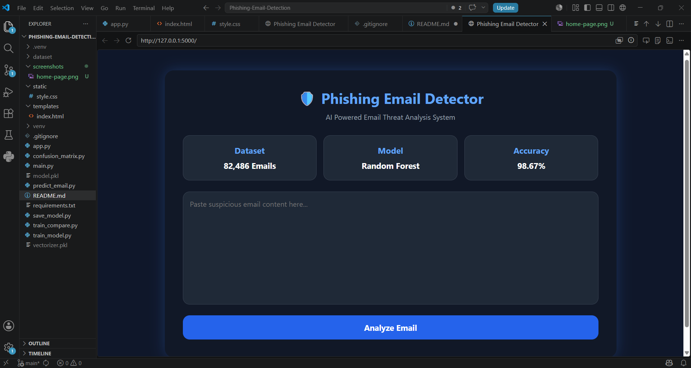

# 🛡️ Phishing Email Detection System

A Machine Learning-based web application that detects phishing emails using NLP and Random Forest Classifier.

## Application Preview



---

## Features

- Detect phishing and legitimate emails
- Real-time email analysis
- Confidence score prediction
- Flask web interface
- TF-IDF text vectorization
- Random Forest Machine Learning model

---

## Model Performance

- Dataset Size: 82,486 Emails
- Algorithm: Random Forest Classifier
- Accuracy: 98.67%

---

## Technologies Used

- Python
- Flask
- Scikit-Learn
- Pandas
- HTML
- CSS

---

## Project Structure

```text
phishing-email-detector/
│
├── app.py
├── model.pkl
├── vectorizer.pkl
├── dataset/
├── templates/
├── static/
└── README.md

## Run Locally

pip install -r requirements.txt
python app.py

Open:
http://127.0.0.1:5000

## Model Accuracy

accuracy_chart.png

## Dataset

Dataset used from Kaggle (82,000+ emails):
https://www.kaggle.com/datasets/naserabdullahalam/phishing-email-dataset

## Author

Maneesha Sulakshana
Cybersecurity Undergraduate