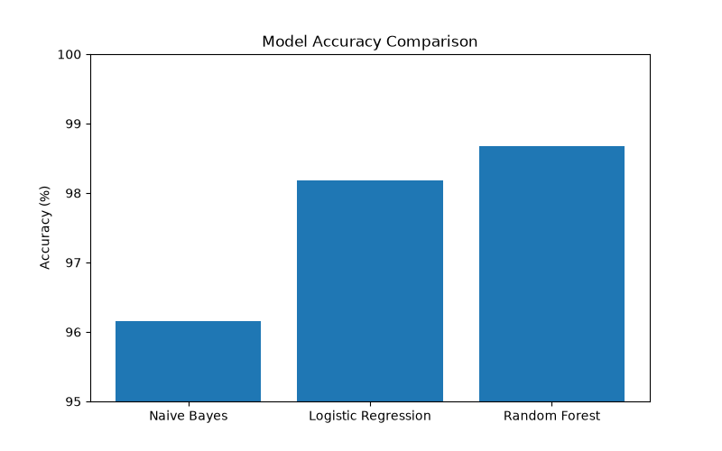

# 🛡️ Phishing Email Detection System

A Machine Learning-based web application that detects phishing emails using Natural Language Processing (NLP) and Random Forest Classification.

## Application Preview


## 🚀 Features

* Detect phishing and legitimate emails
* Real-time email analysis
* Confidence score prediction
* Flask web interface
* TF-IDF text vectorization
* Random Forest Machine Learning model

## 📊 Model Performance

* Dataset Size: 82,486 Emails
* Algorithm: Random Forest Classifier
* Accuracy: 98.67%

## 🛠️ Technologies Used

* Python
* Flask
* Scikit-Learn
* Pandas
* HTML
* CSS

## 📂 Project Structure

```text
phishing-email-detector/
│
├── app.py
├── model.pkl
├── vectorizer.pkl
├── dataset/
├── templates/
├── static/
└── README.md
```

## ▶️ Run Locally

```bash
pip install -r requirements.txt
python app.py
```

Open:

http://127.0.0.1:5000

## 👨‍💻 Author

Maneesha Sulakshana
Cybersecurity Undergraduate

## Model Accuracy Comparison



## Dataset

The dataset used in this project was obtained from Kaggle and contains over 82,000 email samples labeled as phishing or legitimate.
Dataset Source:
https://www.kaggle.com/datasets/naserabdullahalam/phishing-email-dataset